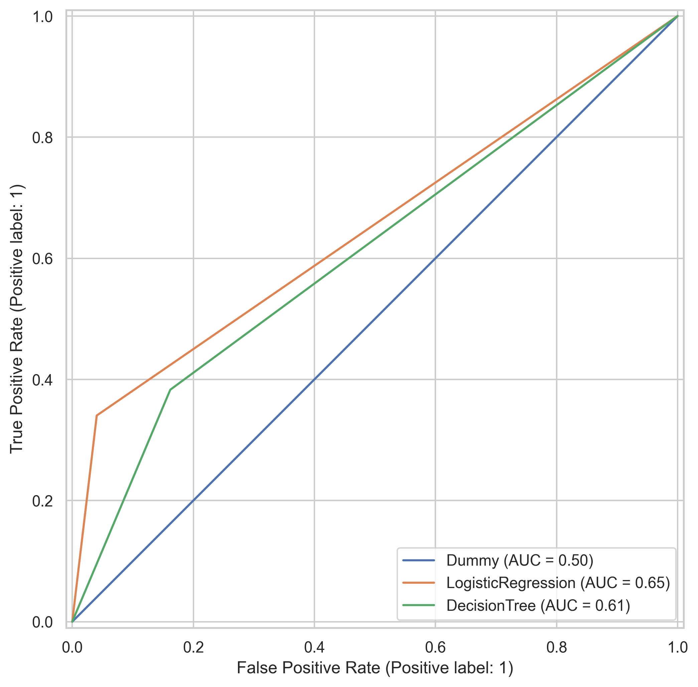

## 3. Measure Phase: Data and Baseline Performance

This phase quantifies the current ("as-is") state of the attrition prediction process. We first characterize the dataset (data quality, distributional properties, imbalance, dependence structure) and then establish statistically grounded baseline model performance that will serve as the reference for subsequent Improve/Control gains.

### 3.1 Dataset Characteristics

The analysis uses the IBM HR Analytics dataset comprising **1,470** employee records and **35** features. The target `Attrition` is binary with a positive ("Yes") rate of **16.12%**, indicating a moderately imbalanced classification problem.

Data quality screening found:
- No missing values in delivered fields.
- Several numeric variables with right skew and outliers (e.g., `MonthlyIncome`, `TotalWorkingYears`).
- Redundant or constant fields (`EmployeeCount`, `StandardHours`) offering no predictive variance.
- Potential linear dependence (correlation) between compensation / seniority indicators (`JobLevel`, `MonthlyIncome`).

Descriptive statistics for selected features (full table in `tables/descriptive_stats_numeric.csv`):

| Feature | Mean | Median | Std | Min | Max |
|---------|------|--------|-----|-----|-----|
| Age | 36.92 | 36.0 | 9.14 | 18.0 | 60.0 |
| MonthlyIncome | 6502.93 | 4919.0 | 4707.96 | 1009.0 | 19999.0 |
| YearsAtCompany | 7.01 | 5.0 | 6.13 | 0.0 | 40.0 |
| TotalWorkingYears | 11.28 | 10.0 | 7.78 | 0.0 | 40.0 |
| JobSatisfaction | 2.73 | 3.0 | 1.10 | 1.0 | 4.0 |

*Table 1: Summary statistics for representative features (see supplementary table for complete numeric set).*

These profiles motivate downstream transformations (e.g., log or power transforms, winsorization) and feature selection / consolidation (especially for correlated pay-related metrics) in the Analyze and Improve phases. A formal multicollinearity assessment (e.g., VIF, condition index) is deferred to the Analyze phase to avoid premature optimization.

### 3.2 Baseline Model Performance

We benchmarked three initial models using stratified 5-fold cross‑validation on the training partition, followed by evaluation on a hold‑out test set:
1. **Dummy Classifier (majority class)** – establishes the irreducible baseline.
2. **Logistic Regression (L2)** – linear, interpretable, robust under moderate multicollinearity.
3. **Decision Tree (unpruned default depth constraint)** – introduces non-linear splits for comparison.

Minimal preprocessing pipeline:
- Numeric: median imputation + standard scaling.
- Categorical: mode imputation + one-hot encoding.
- No resampling or class weighting applied at this stage (to preserve an unadjusted baseline).

Hold‑out performance (test set):

| Model | Accuracy | Precision | Recall | F1-Score | ROC AUC | PR AUC |
|-------|----------|-----------|--------|----------|---------|--------|
| Dummy Classifier | 0.8401 | 0.0000 | 0.0000 | 0.0000 | 0.5000 | 0.1599 |
| Logistic Regression | 0.8605 | 0.6154 | 0.3404 | 0.4384 | 0.8115 | 0.5836 |
| Decision Tree | 0.7653 | 0.3103 | 0.3830 | 0.3429 | 0.6105 | 0.2175 |

*Table 2: Baseline hold‑out metrics (see `tables/baseline_holdout_metrics.csv`).*

Cross‑validation means (for robustness) corroborate relative ordering (see `tables/baseline_metrics_cv.csv`), with Logistic Regression leading in ROC AUC (≈0.84 CV mean) and PR AUC (≈0.65 CV mean), but still exhibiting modest recall (≈0.44 CV mean; 0.34 on hold‑out). The drop from cross‑validated recall (0.44) to test recall (0.34) suggests mild overfitting / threshold sensitivity.

Visual diagnostics:
- **Confusion matrices:** Highlight high false negative proportion (Figure 1).
- **ROC curves:** Show separation vs random; dummy model anchors diagonal (Figure 2).
- **Precision–Recall curves:** Emphasize difficulty in achieving simultaneous high precision and recall at low prevalence; Logistic Regression curve dominates the tree across most thresholds.

*Figure 1: Confusion matrices for baseline models. Imbalance drives dominant true negative counts; positive recall remains constrained.*

*Figure 2: ROC curves for baseline models. Logistic Regression (AUC=0.81) substantially outperforms Decision Tree (AUC=0.61) and Dummy classifier (AUC=0.50).*

### 3.3 Statistical Interpretation

From a measurement perspective:
- **Accuracy inflation:** 0.84 accuracy for the dummy reflects the base rate; thus accuracy alone is a misleading KPI.
- **PR AUC relevance:** Given minority prevalence (~0.16), PR AUC provides a more informative view of ranking quality; Logistic Regression’s PR AUC (~0.58) substantially exceeds the dummy baseline (~0.16), indicating genuine signal capture.
- **Recall gap:** Current recall (0.34–0.38 across logistic/tree) implies >60% of at-risk employees are missed—unacceptable for retention intervention framing.

### 3.4 Measure Phase Findings → Improve Targets

Key quantified deficiencies and associated planned actions:
1. **Class imbalance (16.12% positive)** – Will evaluate class weighting, SMOTE, and calibrated threshold optimization (Youden’s J vs cost-weighted objective).
2. **Low recall / high false negatives** – Will explore alternative decision thresholds, cost-sensitive metrics, and ensemble methods (e.g., Gradient Boosting, XGBoost, LightGBM) in Improve phase.
3. **Potential multicollinearity** – Formal VIF screening; may collapse or regularize correlated compensation/seniority variables.
4. **Skew & outliers** – Consider log / Box-Cox transformations for `MonthlyIncome`, `TotalWorkingYears`, and winsorization for extreme numeric tails.
5. **Non-linear interactions** – Tree-based feature importance and SHAP analysis (Analyze phase) to guide engineered interaction terms or monotonic constraints.

### 3.5 Readiness for Analyze Phase

Artifacts produced in this phase:
- `notebooks/01_EDA.ipynb` – profiling, univariate/bivariate analysis, correlation heatmap.
- `notebooks/02_baseline_models.ipynb` – baseline training & evaluation.
- `tables/descriptive_stats_numeric.csv` – full numeric summary.
- `tables/baseline_metrics_cv.csv` & `tables/baseline_holdout_metrics.csv` – CV vs hold‑out metrics.
- `figures/baseline_confusion_matrices.png` & `figures/baseline_roc_curves.png` – visual diagnostics.
- Draft narrative (`paper/02_measure_phase.md`).

The Measure phase establishes a reproducible baseline with statistically contextualized metrics, enabling targeted hypothesis generation in the Analyze phase rather than ad‑hoc trial-and-error.